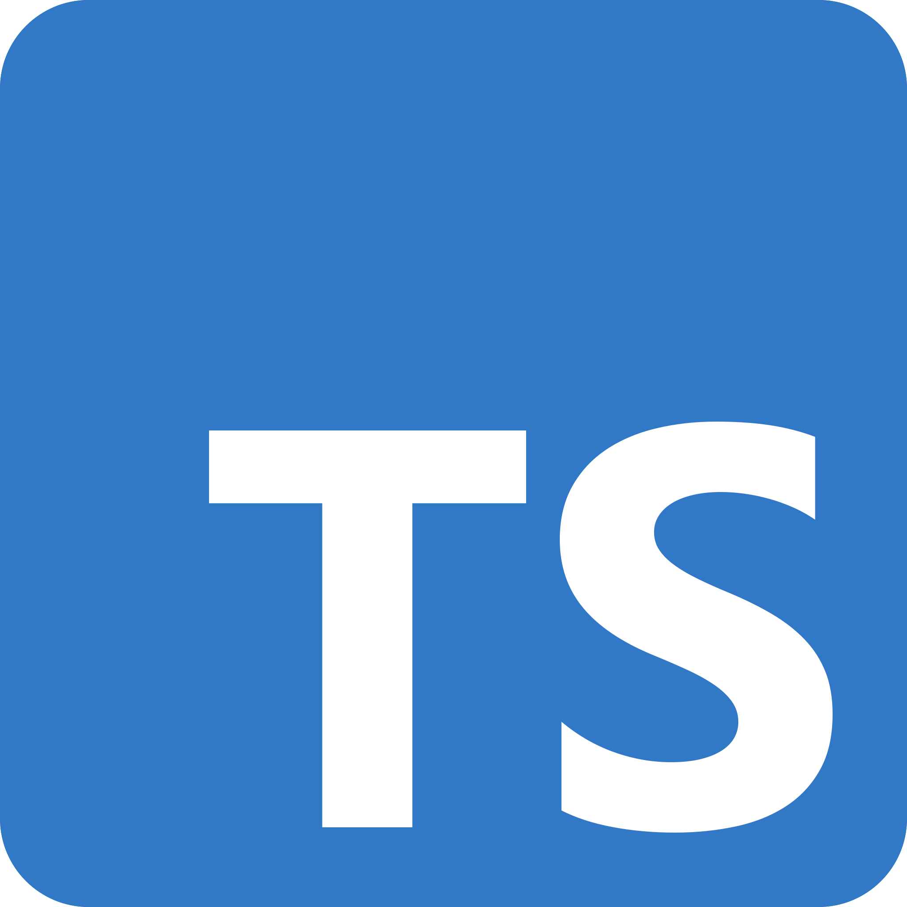
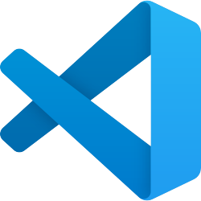
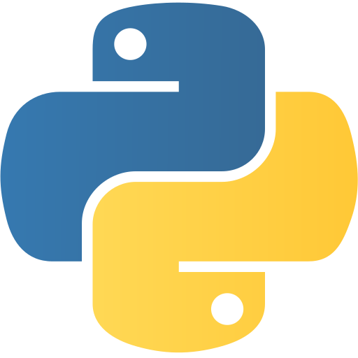

# Compass VS Code Extension

Compass is a VS Code extension for C-source analysis, YAML generation, and Vitis HLS design-space exploration. It wraps the [HGBO-DSE](https://github.com/hzkuang/HGBO-DSE/tree/main) framework, which combines HGP, BOME, and TDM for fast multi-objective optimization of HLS designs.

The extension is intended to streamline a machine-learning-assisted Vitis HLS workflow. It can inspect `.c` files, help generate `config.yaml` and `params.yaml`, package a workspace into `.compass`, run HGBO-DSE, and show generated run artifacts and plots inside VS Code.

## About Compass


## Features

- **C language assistance**: tree-sitter based analysis for functions, loops, parameters, variables, hover hints, CodeLens actions, and config selection state.
- **YAML generation**: generates HGBO-DSE-compatible `config.yaml` and `params.yaml` from the active `.c` file or the first `.c` file in the workspace.
- **Compass workspace flow**: initializes `.compass`, packages source and YAML inputs, and stores run artifacts under `.compass/runs`.
- **Inference + DSE execution**: launches the bundled `3rdParty/HGBO-DSE` Python flow with configurable DSE options.
- **Results UI**: opens previous runs, logs, generated files, DSE plots, Pareto study data, and implementation verification output.
- **Local and remote modes**: local mode is Linux-first and expects Vitis/Vivado 2022.1; remote inference is supported by a Dockerized MCP service.

## Technology Stack

<div style="margin-bottom: 1rem; display: flex; gap: 1rem; flex-wrap: wrap;">
  
  
  
  
  
  
  
  
</div>

- **Extension**: TypeScript, VS Code Extension API, Webpack
- **Webviews**: Svelte, Tailwind CSS, Rollup
- **C analysis**: `web-tree-sitter`, `tree-sitter`, `tree-sitter-c`
- **DSE backend**: Python, HGBO-DSE, PyTorch, Optuna
- **Remote inference**: MCP over HTTP, Docker Compose

## Prerequisites

- VS Code `1.99.0` or newer.
- Node.js with Corepack available. The checked-in package manager is `pnpm@10.33.2`.
- Git submodule support for `3rdParty/HGBO-DSE`.
- Linux plus Vitis/Vivado `2022.1` for local HGBO-DSE execution.
- Python `>=3.9,<3.10` for the HGBO-DSE environment.
- `uv` for the Python backend environment.
- Docker and Docker Compose if you want the MCP remote inference service.

## Set Up

Clone the repo with its HGBO-DSE submodule:

```bash
git clone --recursive <repo-url>
cd compass
```

If you cloned without `--recursive`, initialize the submodule afterwards:

```bash
git submodule update --init --recursive
```

Install the extension and webview dependencies:

```bash
corepack enable
pnpm install --frozen-lockfile
```

Build the extension once:

```bash
pnpm run compile
```

The compile step writes the extension bundle to `dist/` and the webview bundles to `out/compiled/`.

## Backend Set Up

Compass can generate YAML and package workspaces without a Python environment, but running local Inference + DSE needs the bundled HGBO-DSE dependencies.

```bash
cd 3rdParty/HGBO-DSE
uv venv --python 3.9
uv sync
```

Verify the main Python dependencies:

```bash
uv run python -c "import optuna, torch, torch_geometric, torch_scatter, torch_sparse; print('HGBO deps OK')"
```

Then point VS Code at that Python environment with the `compass.hgboPythonPath` setting. For example:

```json
{
  "compass.hgboPythonPath": "/absolute/path/to/compass/3rdParty/HGBO-DSE/.venv/bin/python"
}
```

For local Vitis/Vivado support, Compass auto-discovers Linux installations under common Xilinx paths. If multiple scripts are found, set:

```json
{
  "compass.vivadoSettings64Path": "/path/to/Xilinx/Vitis/2022.1/settings64.sh"
}
```

## Run The Extension

Use the VS Code launch configuration:

1. Open this repository in VS Code.
2. Run `pnpm run watch`, or let the launch task start it for you.
3. Press `F5` and choose **Run Extension**.
4. In the Extension Development Host, open a workspace that contains a `.c` file.
5. Open the Compass activity-bar view.

Typical Compass flow:

1. Click **Init Compass** to create `.compass`.
2. Open or select a `.c` source file.
3. Click **Generate** in the **Generate YAMLs** step to create `config.yaml` and `params.yaml`.
4. Review DSE settings such as mode, algorithm, case, version, iteration count, clock, and inference mode.
5. Click **Package** in the **Package .compass** step to package inputs.
6. Click **Run** in the **Run Inference + DSE** step.
7. Click **Show** in the **Results** step to inspect logs, plots, artifacts, and implementation verification data.

## Development Commands

```bash
pnpm run compile          # build webviews and extension
pnpm run compile:webviews # build Svelte webviews into out/compiled
pnpm run compile:extension # bundle src/extension.ts into dist/extension.js
pnpm run watch            # watch webviews and extension during VS Code debugging
pnpm run package          # production extension bundle
pnpm run lint             # lint TypeScript sources
pnpm run compile-tests    # compile TypeScript tests to out/
pnpm test                 # run VS Code extension tests
```

## Remote Inference Services

Remote mode uses a Dockerized MCP server for HGP model inference. Vitis HLS still runs on the host; only the generated `prj_*/graph` files are sent to the container, so the container does not need a host `.compass` mount or a Vitis installation.

Start the Docker service from `3rdParty/HGBO-DSE`:

```bash
cd 3rdParty/HGBO-DSE
docker compose up --build mcp-inference
```

For normal use, run it detached:

```bash
cd 3rdParty/HGBO-DSE
docker compose up --build -d mcp-inference
docker compose ps
docker compose logs -f mcp-inference
```

The service listens on host port `8000` and exposes the MCP endpoint at:

```text
http://localhost:8000/mcp
```

A plain unauthenticated probe should return `401 Unauthorized`, which confirms the server is reachable and enforcing auth:

```bash
curl -i http://localhost:8000/mcp
```

Retrieve the persistent API key generated inside the named Docker volume:

```bash
cd 3rdParty/HGBO-DSE
docker compose exec mcp-inference uv run python -m backend.mcp_server --show-api-key
```

The key is stored under the `hgbo_mcp_data` Docker volume and survives container restarts. Removing the volume with `docker compose down -v` also removes the key.

To use remote inference from Compass:

1. Start `mcp-inference`.
2. Open the Compass sidebar in the Extension Development Host.
3. Set DSE inference mode to `remote`.
4. Use endpoint `http://localhost:8000/mcp`.
5. Save the API key from `--show-api-key`.
6. Click the remote connection test if available, then run **Inference + DSE**.

Compass stores the key in VS Code SecretStorage and passes it to HGBO-DSE only through the child-process environment. For direct CLI testing, set the same environment variables yourself:

```bash
cd 3rdParty/HGBO-DSE
HGBO_MCP_URL=http://localhost:8000/mcp \
HGBO_MCP_API_KEY=<key-from-show-api-key> \
uv run python -m backend.mcp_client --list-tools
```

Run host DSE with remote inference from the CLI like this:

```bash
cd 3rdParty/HGBO-DSE
HGBO_MCP_URL=http://localhost:8000/mcp \
HGBO_MCP_API_KEY=<key-from-show-api-key> \
HGBO_REMOTE_TIMEOUT_SEC=600 \
uv run python -m bome.hls_dse --mode hgp --inference-mode remote --case bfs --ver bulk --num 10 --isolated context1
```

Stop the service when finished:

```bash
cd 3rdParty/HGBO-DSE
docker compose down
```

## Project Layout

- `src/extension.ts`: VS Code activation, command registration, tree-sitter warmup, Vivado discovery, and sidebar wiring.
- `src/parser/`: C analysis, TDM discovery, config state, hover, CodeLens, and decorations.
- `src/services/`: YAML generation, HGBO-DSE packaging, runner, DSE option parsing, and result processing.
- `src/providers/`: Compass sidebar and results webview providers.
- `webviews/`: Svelte webview pages, components, styles, and browser-side modules.
- `resources/`: tree-sitter WASM grammar assets.
- `3rdParty/HGBO-DSE/`: Python DSE backend and model code.
- `.compass/`: generated per-workspace metadata, packages, runs, logs, and artifacts.

## Extension Settings

- `compass.vivadoSettings64Path`: optional path to the Vitis/Vivado `settings64.sh` script. Use this when auto-discovery cannot safely choose one.
- `compass.hgboPythonPath`: Python executable used to launch `3rdParty/HGBO-DSE`.
- `compass.remoteInferenceMcpEndpoint`: MCP endpoint for Dockerized remote HGBO-DSE inference. Defaults to `http://localhost:8000/mcp`.

## Known Issues

- Local mode currently targets Linux and Vitis/Vivado `2022.1`.
- HGBO-DSE requires Python `3.9`; newer Python versions are outside the bundled backend's declared range.
- Remote inference needs the Docker MCP service and the generated API key saved in Compass.

## Release Notes

### 0.0.1

Initial Compass extension release, still under active development.

## References

- [VS Code Extension API](https://code.visualstudio.com/api)
- [VS Code Extension Samples](https://github.com/microsoft/vscode-extension-samples)
- [HGBO-DSE paper](https://ieeexplore.ieee.org/document/10416120)

## Author(s)

- Jimmy Wang (王俊崴) [@jwwang2003](https://github.com/jwwang2003)
